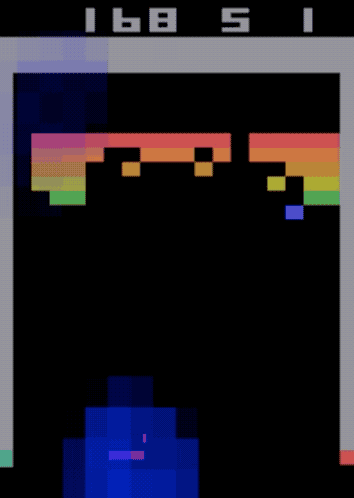
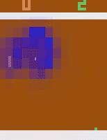
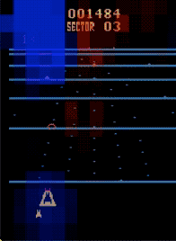
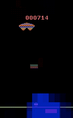

# Explainable DQN PyTorch

Implementation of the Deep Q-learning algorithm [1] on the Atari Pong environment with real-time saliency visualization [2]. Implementation of the Dueling arhcitecture [3] and the Double DQN [4].

## References
1. *Playing Atari with Deep Reinforcement Learning*, Mnih et al., 2013
2. *Visualizing and Understanding Atari Agents* Sam Greydanus et al., 2017
3. *Dueling Network Architectures for Deep Reinforcement Learning*, Ziyu Wang et al., 2015
4. *Deep Reinforcement Learning with Double Q-learning*, Hado van Hasselt, Arthur Guez, and David Silver, 2015 

